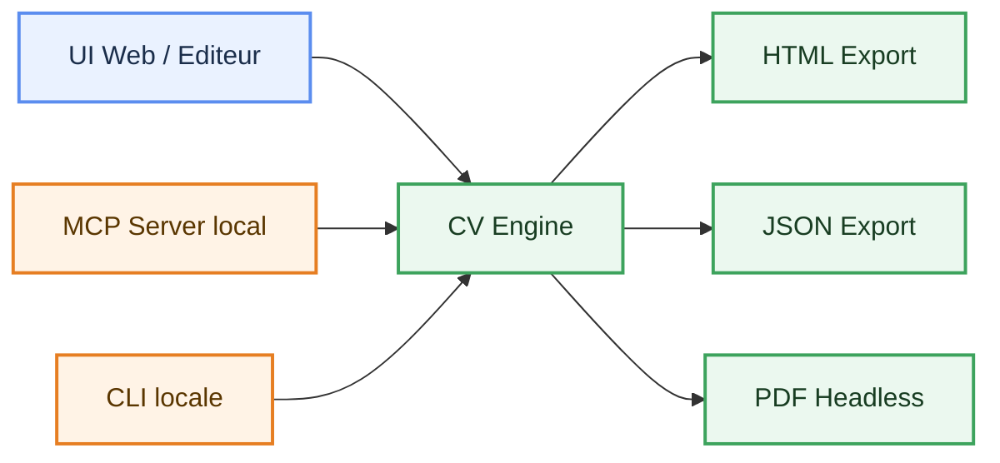
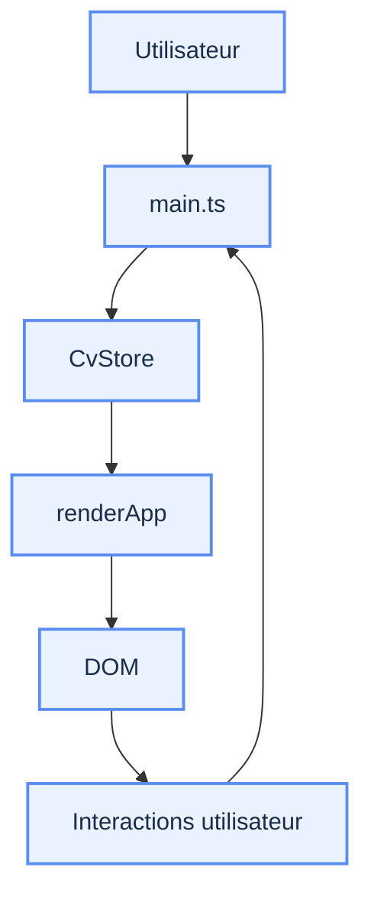
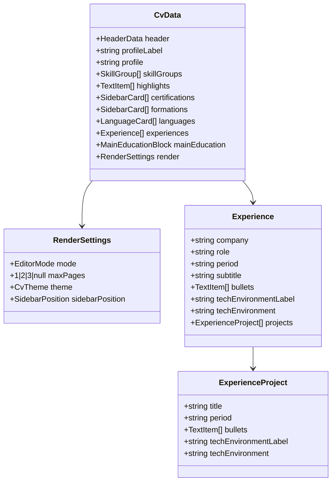
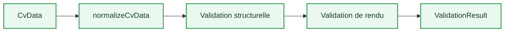
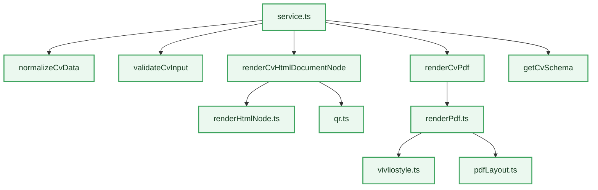
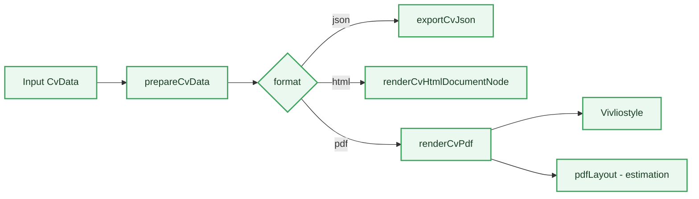
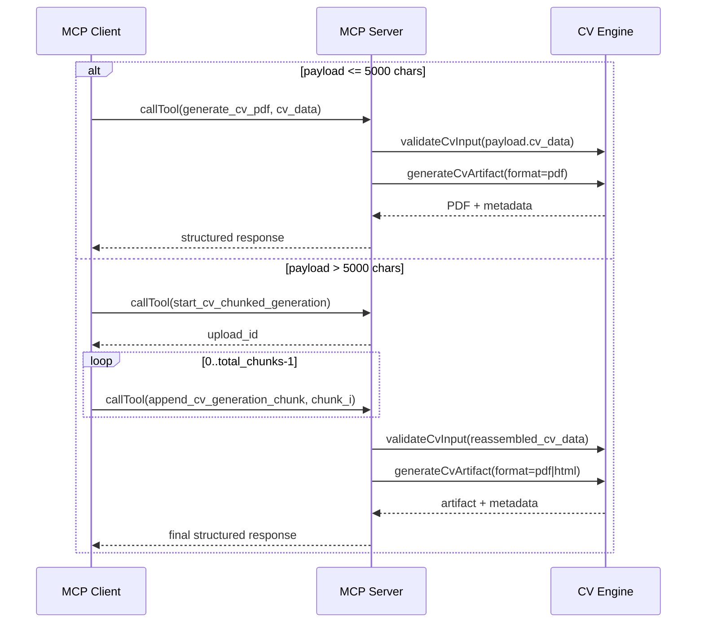
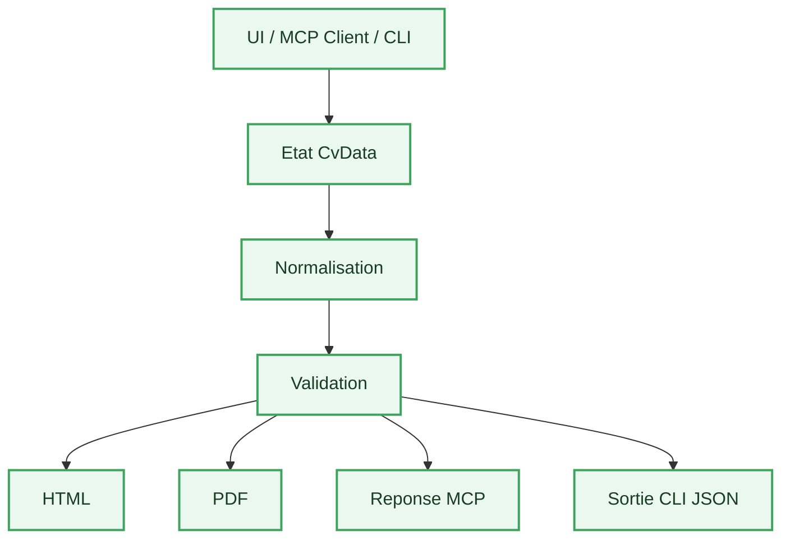

# Architecture Applicative - CV Generator

## Objet

Ce document decrit l'architecture applicative du projet `CV_Generator` :

- ses composants
- leurs responsabilites
- les flux entre eux
- les frontieres techniques
- les points d'entree

Ce document est volontairement descriptif.

Il ne sert pas a argumenter un choix ; il sert a expliquer **comment l'application est construite et comment elle fonctionne**.

---

## Vue D'Ensemble

L'application est composee de 4 sous-systemes principaux :

1. **UI Web**
2. **CV Engine**
3. **Serveur MCP local**
4. **CLI locale**

Positionnement :

- l'UI web est l'interface d'edition humaine
- le moteur Node est la source de verite
- le serveur MCP est la couche d'exposition principale pour les agents
- la CLI locale est un adaptateur terminal aligne sur la surface MCP



---

## Structure Des Dossiers

```text
CV_Generator/
  src/
    app.ts
    constants.ts
    main.ts
    model.ts
    store.ts
    validationShared.ts
    types.ts
    validation.ts
    vite-env.d.ts
    styles.css
    cli/
      cvCli.ts
    data/
      presets.ts
      sampleCv.ts
    engine/
      index.ts
      output.ts
      pdfLayout.ts
      qr.ts
      renderHtml.ts
      renderHtmlNode.ts
      renderPdf.ts
      schema.ts
      service.ts
      validateNode.ts
      validationBrowser.ts
      vivliostyle.ts
    mcp/
      server.ts
  scripts/
    smoke-pdf.ts
  tests/
    cli.test.ts
    fixtures/
    engine-service.test.ts
    mcp-server.test.ts
    render-pdf.test.ts
```

---

## Sous-Systeme 1 - UI Web

## Role

La UI web sert a l'edition humaine du CV.

Elle permet :

- la modification inline du contenu
- le choix du theme
- le choix de la position de la sidebar
- l'import/export JSON et HTML
- la previsualisation

## Fichiers Principaux

- [main.ts](./src/main.ts)
- [app.ts](./src/app.ts)
- [styles.css](./src/styles.css)
- [store.ts](./src/store.ts)

## Fonctionnement



### `main.ts`

Responsabilites :

- chargement de l'etat initial
- ecoute des evenements DOM
- orchestration des actions utilisateur
- rerender de l'application
- import/export cote navigateur

### `app.ts`

Responsabilites :

- composition du markup HTML
- rendu du CV
- rendu des controles d'edition

### `store.ts`

Responsabilites :

- stockage de l'etat courant
- diffusion des mises a jour

### `styles.css`

Responsabilites :

- structure visuelle du template
- themes
- presentation print
- presentation edition / preview

---

## Sous-Systeme 2 - Modele Metier

## Role

Le modele metier decrit la structure d'un CV.

## Fichiers Principaux

- [types.ts](./src/types.ts)
- [model.ts](./src/model.ts)
- [constants.ts](./src/constants.ts)

## `types.ts`

Contient :

- `CvData`
- `HeaderData`
- `SkillGroup`
- `Experience`
- `SidebarCard`
- `RenderSettings`
- types utilitaires de validation

## `model.ts`

Contient :

- normalisation de `CvData`
- valeurs par defaut
- creation d'elements
- manipulation par chemin (`setValueAtPath`, `moveItemAtPath`, etc.)
- migration douce de certaines valeurs

## Schema Logique Du Modele



---

## Sous-Systeme 3 - Validation

## Role

Le projet contient 2 types de validation :

1. validation navigateur
2. validation Node embarquee

## Validation Navigateur

Fichiers :

- [validation.ts](./src/validation.ts)
- [validationBrowser.ts](./src/engine/validationBrowser.ts)

Usage :

- feedback visuel dans l'editeur
- surlignage des depassements
- estimation de pagination a l'ecran

## Validation Node

Fichier :

- [validateNode.ts](./src/engine/validateNode.ts)

Usage :

- validation utilisable hors UI
- estimation de pagination sans navigateur externe
- production de `pageCount`, `issues`, `structureMessages`

## Flux De Validation



---

## Sous-Systeme 4 - CV Engine

## Role

Le `CV Engine` est la couche reutilisable.

Il encapsule :

- la normalisation
- la validation
- le rendu HTML
- le rendu PDF
- l'acces au schema

## Fichiers Principaux

- [service.ts](./src/engine/service.ts)
- [renderHtml.ts](./src/engine/renderHtml.ts)
- [renderHtmlNode.ts](./src/engine/renderHtmlNode.ts)
- [renderPdf.ts](./src/engine/renderPdf.ts)
- [schema.ts](./src/engine/schema.ts)
- [output.ts](./src/engine/output.ts)
- [qr.ts](./src/engine/qr.ts)

## Organisation Interne



### `service.ts`

Facade principale de l'engine.

Expose :

- `prepareCvData`
- `validateCvInput`
- `generateCvArtifact`
- `getCvSchema`
- `exportCvJson`

### `renderHtml.ts`

Renderer HTML cote navigateur.

Usage :

- export HTML depuis l'UI

### `renderHtmlNode.ts`

Renderer HTML cote Node.

Usage :

- generation headless
- source de verite pour le PDF

### `renderPdf.ts`

Facade PDF headless, basee sur `Vivliostyle`.

Supporte :

- `mode: "paginated"`
- `mode: "continuous"`

### `pdfLayout.ts`

Moteur d'estimation de pagination et de mesures de rendu.

Responsabilites :

- calcul de pagination
- estimation des depassements de lignes critiques

### `vivliostyle.ts`

Adaptateur HTML/CSS vers PDF.

Responsabilites :

- ecriture d'un HTML temporaire autonome
- appel a `@vivliostyle/cli`
- generation du PDF final
- prise en charge du mode `continuous` avec taille de page calculee

### `schema.ts`

Expose le JSON Schema de `CvData`.

### `output.ts`

Responsable de l'ecriture securisee des artefacts binaires temporaires.

### `qr.ts`

Responsable de la generation du QR code.

## Contrat d'entree et separation des parametres

Le contrat principal du systeme reste `CvData`.

Les parametres se repartissent ainsi :

- parametres metier et rendu dans `cv_data`
- parametres d'execution au niveau du tool MCP

Exemples :

- `cv_data.render.theme`
- `cv_data.render.sidebarPosition`
- `cv_data.render.maxPages`
- `generate_cv_pdf.pdf_mode`
- `generate_cv_pdf.browser_executable_path` (optionnel)
- `validate_cv.browser_executable_path` (optionnel)
- `generate_cv_html.browser_executable_path` (optionnel)

Important :

- `pageCount` n'est pas un champ metier de `CvData`
- c'est une metrique calculee par le moteur

---

## Modes D'Export

L'engine supporte 3 formats d'artefacts :

- `json`
- `html`
- `pdf`

## Pipeline D'Export



### PDF - Mode `paginated`

Comportement :

- A4
- pagination CSS/HTML via `Vivliostyle`
- rendu visuellement aligne sur le template HTML source

### PDF - Mode `continuous`

Comportement :

- une seule grande page PDF
- hauteur calculee selon le contenu estime
- rendu genere par `Vivliostyle` avec taille de page personnalisee

## Regles de pagination

Quand `render.maxPages` est defini :

- la validation expose `page_limit_exceeded`
- les exports `html` et `pdf` pagine peuvent refuser le rendu final
- le mode PDF `continuous` peut rester autorise comme mode de sortie alternatif

---

## Sous-Systeme 5 - MCP Server

## Role

Le serveur MCP expose le moteur a un agent externe.

## Fichier Principal

- [server.ts](./src/mcp/server.ts)

## Transport

- `stdio`

Le serveur :

- n'est pas un serveur HTTP
- n'est pas la UI
- tourne en process local

## Tools Exposes

Surface stable beta :

- `generate_cv_html`
- `generate_cv_pdf`
- `validate_cv`
- `get_cv_schema`

Tools additionnels pour gros payloads :

- `start_cv_chunked_generation`
- `append_cv_generation_chunk`

## Semantique des tools

### `get_cv_schema`

Retourne le schema JSON du contrat `CvData`.

Compatibilite client :

- le schema reste dans `structuredContent.schema`
- une copie texte du schema est aussi renvoyee dans `content` pour les clients MCP qui n'exposent pas `structuredContent` au modele

### `validate_cv`

Normalise et valide un `CvData`, puis retourne :

- diagnostics structurels
- diagnostics de rendu
- `page_count`
- `page_limit_exceeded`

### `generate_cv_html`

Genere le rendu HTML final a partir d'un `CvData` valide.

Contrainte :

- appel direct accepte seulement si `JSON.stringify(cv_data).length <= 5000`
- sinon erreur `cv_data_too_large_for_single_call` et bascule vers workflow chunked

### `generate_cv_pdf`

Genere le rendu PDF final a partir d'un `CvData` valide.

Le tool supporte 2 modes :

- `paginated`
- `continuous`

Contrainte :

- appel direct accepte seulement si `JSON.stringify(cv_data).length <= 5000`
- sinon erreur `cv_data_too_large_for_single_call` et bascule vers workflow chunked

### `start_cv_chunked_generation`

Cree une session d'upload chunked et retourne un `upload_id`.

Important :

- le client doit reutiliser exactement cet `upload_id` dans `append_cv_generation_chunk`
- si un mauvais `upload_id` est envoye et qu'une seule session est active, le serveur peut auto-resoudre la session

Parametres :

- `upload_id` (optionnel, identifiant client explicite)
- `output_format: "pdf" | "html"` (defaut `pdf`)
- `pdf_mode` (si `output_format = "pdf"`)
- `browser_executable_path` (optionnel)

### `append_cv_generation_chunk`

Ajoute un chunk de JSON dans une session:

- `chunk_index` 0-based
- `total_chunks` constant sur toute la session
- `chunk` limite a 5000 caracteres

Auto-finalisation :

- quand tous les chunks sont recus, le serveur reassemble le JSON, valide et genere automatiquement l'artefact cible

## Flux MCP



## Comportement du serveur

Pour chaque tool :

1. reception de l'entree
2. validation du payload
3. appel a la facade `engine/service.ts`
4. construction d'une reponse MCP structuree

En cas d'erreur :

- retour `isError: true`
- `structuredContent` stable

---

## Sous-Systeme 6 - CLI Locale

## Role

La CLI locale expose les memes capacites metier que le MCP, en mode terminal.

Elle permet :

- l'usage scriptable hors chat MCP
- la validation d'un `cv_data` depuis un fichier JSON
- la generation HTML/PDF avec un chemin de sortie explicite
- un contournement pratique des limites de tool-call de certains petits LLM

## Fichier Principal

- [cvCli.ts](./src/cli/cvCli.ts)

## Commandes exposees

- `get-cv-schema`
- `validate-cv`
- `generate-cv-html`
- `generate-cv-pdf`

## Semantique

- workflow recommande: `get-cv-schema -> validate-cv -> generate-cv-pdf/html`
- sortie JSON stable sur `stdout`
- code de sortie `0` en succes, `1` en erreur

---

## Sous-Systeme 7 - Tests

## Role

Verifier :

- le schema
- le moteur
- le PDF
- le serveur MCP
- la CLI

## Fichiers Principaux

- [engine-service.test.ts](./tests/engine-service.test.ts)
- [render-pdf.test.ts](./tests/render-pdf.test.ts)
- [mcp-server.test.ts](./tests/mcp-server.test.ts)
- [cli.test.ts](./tests/cli.test.ts)

## Couverture Actuelle

### Engine

- schema accessible
- normalisation
- generation HTML

### PDF

- generation PDF valide
- mode pagine via `Vivliostyle`
- mode continu via `Vivliostyle`
- aucun chemin de navigateur systeme a fournir dans le flux MCP normal
- possibilite d'override explicite via `browser_executable_path` si l'environnement headless local est incomplet

### MCP

- listing des tools
- schema
- generation HTML
- generation PDF continue
- limite 5000 chars en appel direct
- workflow chunked avec auto-finalisation

### CLI

- aide globale et aide par commande
- schema, validation et generation HTML
- format de sortie JSON stable

---

## Frontieres Techniques

## Ce qui reste cote navigateur

- edition
- preview
- feedback visuel
- export HTML navigateur
- import/export JSON navigateur
- impression utilisateur via navigateur

## Ce qui reste cote Node

- rendu PDF headless
- validation headless
- schema JSON
- exposition MCP
- exposition CLI
- ecriture de fichiers PDF temporaires

## Regle De Separation

Le front ne doit pas importer de code Node-only.

En particulier :

- pas de `playwright-core` dans le bundle web
- pas de `fs` / `node:*` dans l'UI
- pas d'import `@vivliostyle/cli` dans le bundle web

---

## Points D'Entree

## UI

- [main.ts](./src/main.ts)

## MCP

- [server.ts](./src/mcp/server.ts)

## CLI

- [cvCli.ts](./src/cli/cvCli.ts)

## Smoke PDF

- [smoke-pdf.ts](./scripts/smoke-pdf.ts)

---

## Commandes Principales

### Lancer l'UI

```powershell
npm.cmd run dev
```

### Build

```powershell
npm.cmd run build
```

### Tests

```powershell
npm.cmd test
```

### Lancer le MCP

```powershell
npm.cmd run mcp
```

### Lancer le CLI (surface alignee MCP)

```powershell
npm.cmd run cli -- --help
```

Exemples :

```powershell
npm.cmd run cli -- get-cv-schema
npm.cmd run cli -- validate-cv --cv-data .\examples\cv-minimal.json
npm.cmd run cli -- generate-cv-html --cv-data .\examples\cv-minimal.json --output .\cv-output.html
npm.cmd run cli -- generate-cv-pdf --cv-data .\examples\cv-minimal.json --pdf-mode paginated --output .\cv-output.pdf
```

### Smoke PDF pagine

```powershell
npm.cmd run smoke:pdf
```

### Smoke PDF continu

```powershell
$env:CV_PDF_MODE="continuous"
npm.cmd run smoke:pdf
```

### Smoke PDF avec navigateur force (optionnel)

```powershell
$env:CV_BROWSER_EXECUTABLE_PATH="C:\Program Files\Google\Chrome\Application\chrome.exe"
npm.cmd run smoke:pdf
```

---

## Cycle De Vie D'Un CV



---

## Resume

L'application fonctionne comme suit :

- la UI web edite un `CvData`
- le moteur transforme ce `CvData` en HTML, PDF ou validation
- le serveur MCP expose ce moteur a un agent externe
- la CLI locale expose le meme moteur en mode terminal

Le coeur du systeme est donc :

- **le modele `CvData`**
- **la facade `engine/service.ts`**

Et les trois consommateurs principaux sont :

- **l'UI**
- **le MCP**
- **la CLI**

L'architecture est aussi pensee pour rester compatible avec d'autres couches d'appel locales, par exemple :

- des scripts shell / CI
- un bridge MCP pour LM Studio
- d'autres clients capables de lancer un process local
