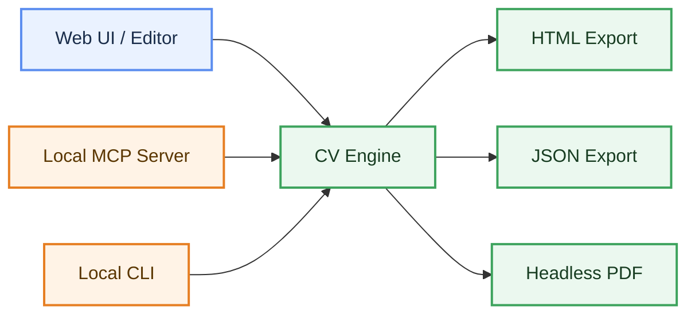
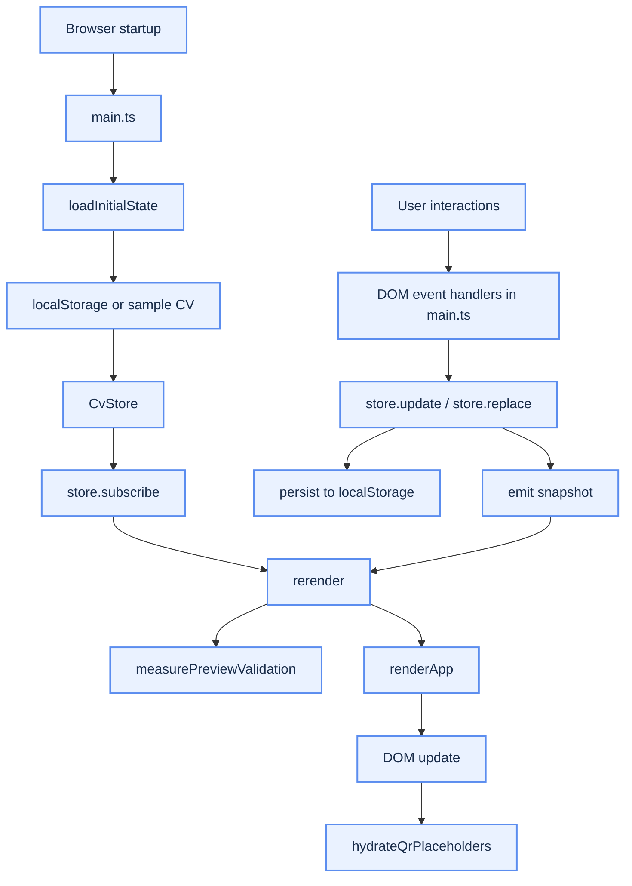
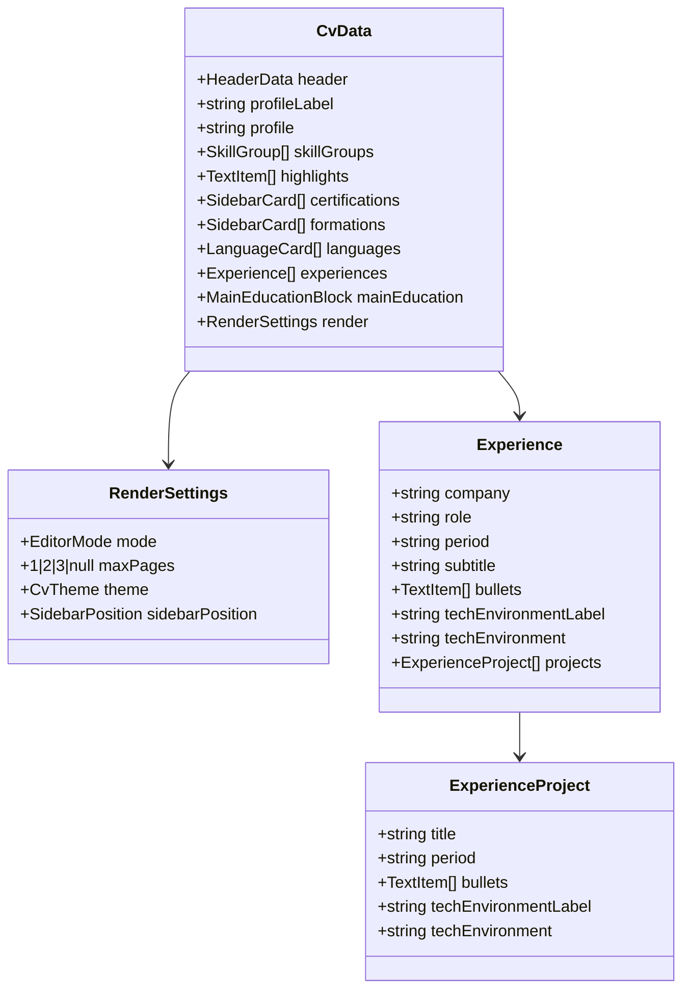
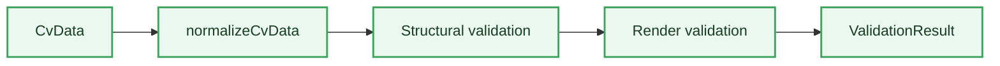
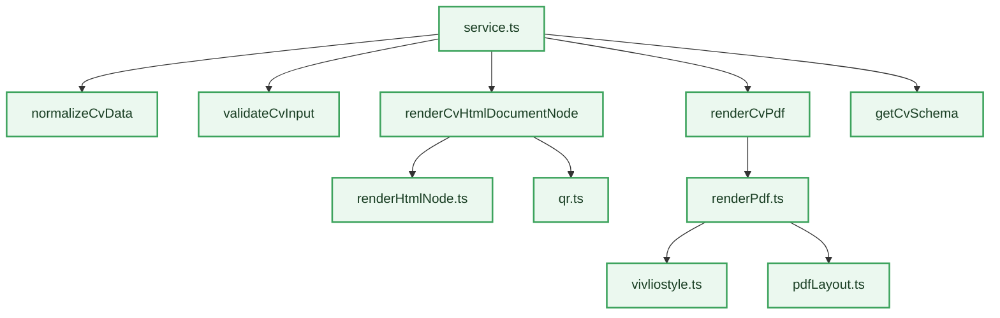
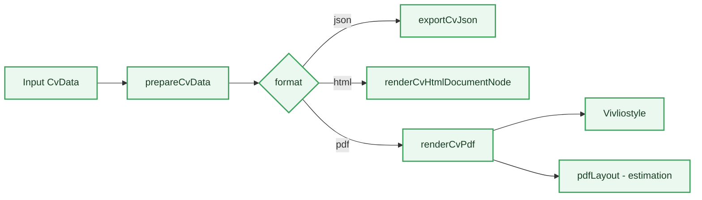
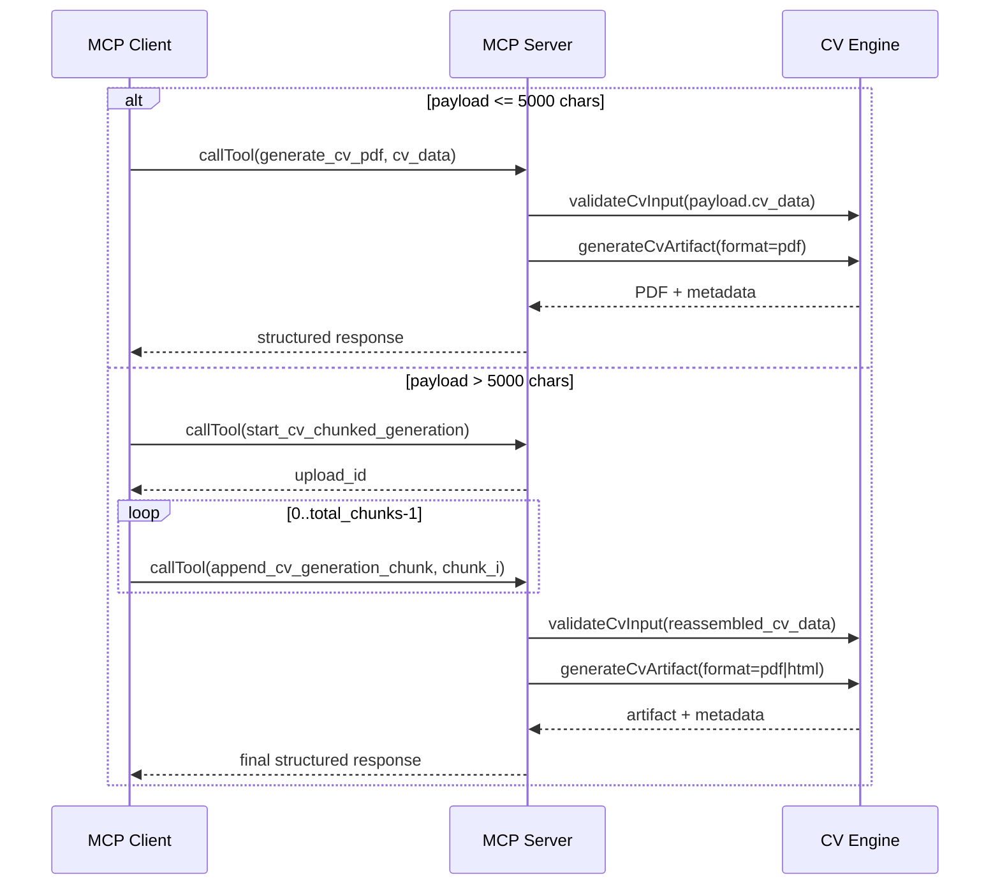
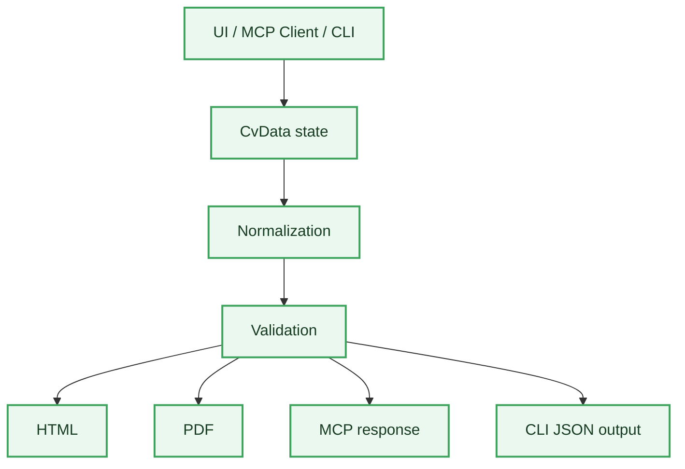

# Application Architecture - CV Generator

## Purpose

This document describes the application architecture of the `CV_Generator` project:

- its components
- their responsibilities
- the flows between them
- the technical boundaries
- the entry points

This document is intentionally descriptive.

It is not meant to argue for a design choice. Its role is to explain **how the application is built and how it works**.

---

## Overview

The application is composed of 4 main subsystems:

1. **Web UI**
2. **CV Engine**
3. **Local MCP Server**
4. **Local CLI**

Positioning:

- the web UI is the human editing interface
- the Node engine is the source of truth
- the MCP server is the main exposure layer for agents
- the local CLI is a terminal adapter aligned with the MCP surface



---

## Repository Structure

```text
CV_Generator/
  bin/
    cv-generator-mcp.mjs
  examples/
    cv-cloud-architect.json
    cv-devops.json
    cv-java.json
    cv-minimal.json
    cv-sophro.json
  skills/
    cv-generator/
      SKILL.md
      agents/
        openai.yaml
      references/
        cv-contract.md
  src/
    app.ts
    constants.ts
    main.ts
    model.ts
    store.ts
    validationShared.ts
    types.ts
    validation.ts
    vite-env.d.ts
    styles.css
    cli/
      cvCli.ts
    data/
      presets.ts
      sampleCv.ts
    engine/
      index.ts
      output.ts
      pdfLayout.ts
      qr.ts
      renderHtml.ts
      renderHtmlNode.ts
      renderPdf.ts
      schema.ts
      service.ts
      validateNode.ts
      validationBrowser.ts
      vivliostyle.ts
    mcp/
      server.ts
  scripts/
    install-skill.sh
    print-mcp-config.sh
    smoke-pdf.ts
  tests/
    cli.test.ts
    distribution.test.ts
    examples.test.ts
    fixtures/
    engine-service.test.ts
    mcp-server.test.ts
    render-pdf.test.ts
```

---

## Subsystem 1 - Web UI

## Role

The web UI is used for human CV editing.

It supports:

- inline content editing
- theme selection
- sidebar position selection
- JSON and HTML import / export
- preview rendering

## Main Files

- [main.ts](./src/main.ts)
- [app.ts](./src/app.ts)
- [styles.css](./src/styles.css)
- [store.ts](./src/store.ts)

## Runtime Flow



### `main.ts`

Responsibilities:

- loading initial state
- hydrating persisted state from `localStorage`
- listening to DOM events
- orchestrating user actions
- running preview validation before UI rendering
- rerendering the application
- hydrating QR placeholders after render
- browser-side import / export

### `app.ts`

Responsibilities:

- composing the HTML markup
- rendering the CV
- rendering editing controls

### `store.ts`

Responsibilities:

- storing the current state
- persisting state to `localStorage`
- broadcasting updates

### `styles.css`

Responsibilities:

- visual structure of the template
- themes
- print presentation
- editor / preview presentation

---

## Subsystem 2 - Business Model

## Role

The business model describes the structure of a CV.

## Main Files

- [types.ts](./src/types.ts)
- [model.ts](./src/model.ts)
- [constants.ts](./src/constants.ts)

## `types.ts`

Contains:

- `CvData`
- `HeaderData`
- `SkillGroup`
- `Experience`
- `SidebarCard`
- `RenderSettings`
- validation utility types

## `model.ts`

Contains:

- `CvData` normalization
- default values
- item creation helpers
- path-based manipulation (`setValueAtPath`, `moveItemAtPath`, and related helpers)
- soft migration of selected values

## Logical Model Schema



---

## Subsystem 3 - Validation

## Role

The project contains 2 validation modes:

1. browser validation
2. embedded Node validation

## Browser Validation

Files:

- [validation.ts](./src/validation.ts)
- [validationBrowser.ts](./src/engine/validationBrowser.ts)

Usage:

- visual feedback in the editor
- overflow highlighting
- on-screen pagination estimation

## Node Validation

File:

- [validateNode.ts](./src/engine/validateNode.ts)

Usage:

- validation outside the UI
- pagination estimation without an external browser
- production of `pageCount`, `issues`, and `structureMessages`

## Validation Flow



---

## Subsystem 4 - CV Engine

## Role

The `CV Engine` is the reusable core layer.

It encapsulates:

- normalization
- validation
- HTML rendering
- PDF rendering
- schema access

## Main Files

- [service.ts](./src/engine/service.ts)
- [renderHtml.ts](./src/engine/renderHtml.ts)
- [renderHtmlNode.ts](./src/engine/renderHtmlNode.ts)
- [renderPdf.ts](./src/engine/renderPdf.ts)
- [schema.ts](./src/engine/schema.ts)
- [output.ts](./src/engine/output.ts)
- [qr.ts](./src/engine/qr.ts)

## Internal Organization



### `service.ts`

Main engine facade.

Exposes:

- `prepareCvData`
- `validateCvInput`
- `generateCvArtifact`
- `getCvSchema`
- `exportCvJson`

### `renderHtml.ts`

Browser-side HTML renderer.

Usage:

- HTML export from the UI

### `renderHtmlNode.ts`

Node-side HTML renderer.

Usage:

- headless generation
- source of truth for PDF generation

### `renderPdf.ts`

Headless PDF facade based on `Vivliostyle`.

Supports:

- `mode: "paginated"`
- `mode: "continuous"`

### `pdfLayout.ts`

Pagination estimation and render measurement helper.

Responsibilities:

- pagination computation
- estimation of critical overflow conditions

### `vivliostyle.ts`

HTML/CSS to PDF adapter.

Responsibilities:

- writing a self-contained temporary HTML file
- calling `@vivliostyle/cli`
- generating the final PDF
- supporting `continuous` mode with a computed page size

### `schema.ts`

Exposes the JSON Schema for `CvData`.

### `output.ts`

Responsible for safe temporary binary artifact writing.

### `qr.ts`

Responsible for QR code generation.

## Input Contract and Parameter Separation

The main system contract remains `CvData`.

Parameters are split as follows:

- business and rendering parameters live inside `cv_data`
- execution parameters live at the MCP tool level

Examples:

- `cv_data.render.theme`
- `cv_data.render.sidebarPosition`
- `cv_data.render.maxPages`
- `generate_cv_pdf.pdf_mode`
- `generate_cv_pdf.browser_executable_path` (optional)
- `validate_cv.browser_executable_path` (optional)
- `generate_cv_html.browser_executable_path` (optional)

Important:

- `pageCount` is not a business field of `CvData`
- it is a computed metric produced by the engine

---

## Export Modes

The engine supports 3 artifact formats:

- `json`
- `html`
- `pdf`

## Export Pipeline



### PDF - `paginated` Mode

Behavior:

- A4 output
- CSS / HTML pagination through `Vivliostyle`
- output visually aligned with the source HTML template

### PDF - `continuous` Mode

Behavior:

- a single large PDF page
- height computed from estimated content size
- output generated by `Vivliostyle` with a custom page size

## Pagination Rules

When `render.maxPages` is defined:

- validation exposes `page_limit_exceeded`
- `html` export and paginated `pdf` export can reject final rendering
- `continuous` PDF can remain available as an alternative output mode

---

## Subsystem 5 - MCP Server

## Role

The MCP server exposes the engine to an external agent.

## Main File

- [server.ts](./src/mcp/server.ts)

## Transport

- `stdio`

The server:

- is not an HTTP server
- is not the UI
- runs as a local process

Local distribution:

- the repository provides a `bin/cv-generator-mcp.mjs` binary
- this binary allows direct execution through `npx`, without going through `npm run mcp`
- this distribution mainly targets local clients such as Hermes and Claude Code

## Exposed Tools

Stable beta surface:

- `generate_cv_html`
- `generate_cv_pdf`
- `validate_cv`
- `get_cv_schema`

Additional tools for large payload workflows:

- `start_cv_chunked_generation`
- `append_cv_generation_chunk`

## Tool Semantics

### `get_cv_schema`

Returns the JSON schema for the `CvData` contract.

Client compatibility:

- the schema remains available in `structuredContent.schema`
- a text copy of the schema is also returned in `content` for MCP clients that do not expose `structuredContent` to the model

### `validate_cv`

Normalizes and validates a `CvData`, then returns:

- structural diagnostics
- render diagnostics
- `page_count`
- `page_limit_exceeded`

### `generate_cv_html`

Generates the final HTML output from a valid `CvData`.

Constraint:

- direct call accepted only if `JSON.stringify(cv_data).length <= 5000`
- otherwise error `cv_data_too_large_for_single_call` and fallback to the chunked workflow

### `generate_cv_pdf`

Generates the final PDF output from a valid `CvData`.

The tool supports 2 modes:

- `paginated`
- `continuous`

Constraint:

- direct call accepted only if `JSON.stringify(cv_data).length <= 5000`
- otherwise error `cv_data_too_large_for_single_call` and fallback to the chunked workflow

### `start_cv_chunked_generation`

Creates a chunked upload session and returns an `upload_id`.

Important:

- the client must reuse that exact `upload_id` in `append_cv_generation_chunk`
- if a wrong `upload_id` is sent and only one session is active, the server can auto-resolve the session

Parameters:

- `upload_id` (optional, explicit client identifier)
- `output_format: "pdf" | "html"` (default `pdf`)
- `pdf_mode` (if `output_format = "pdf"`)
- `browser_executable_path` (optional)

### `append_cv_generation_chunk`

Adds a JSON chunk to a session:

- `chunk_index` is 0-based
- `total_chunks` remains constant for the whole session
- `chunk` is limited to 5000 characters

Auto-finalization:

- when all chunks are received, the server reassembles the JSON, validates it, and automatically generates the target artifact

## MCP Flow



## Server Behavior

For each tool:

1. receive input
2. validate the payload
3. call the `engine/service.ts` facade
4. build a structured MCP response

On error:

- return `isError: true`
- keep `structuredContent` stable

---

## Subsystem 6 - Local CLI

## Role

The local CLI exposes the same business capabilities as MCP through a terminal interface.

It supports:

- scriptable usage outside MCP chat flows
- validation of a `cv_data` payload from a JSON file
- HTML / PDF generation with an explicit output path
- a practical workaround for tool-call limits of some smaller LLMs

## Main File

- [cvCli.ts](./src/cli/cvCli.ts)

## Exposed Commands

- `get-cv-schema`
- `validate-cv`
- `generate-cv-html`
- `generate-cv-pdf`

## Semantics

- recommended workflow: `get-cv-schema -> validate-cv -> generate-cv-pdf/html`
- stable JSON output on `stdout`
- exit code `0` on success, `1` on error

---

## Subsystem 7 - Skill Bundle

## Role

The repository includes a portable skill bundle to guide agents that consume the MCP server.

This skill:

- does not implement business logic
- does not replace MCP
- documents the recommended workflow (`schema -> validate -> generate`)
- helps clients such as Hermes and Claude Code use the public tools correctly

## Main Files

- [skills/cv-generator/SKILL.md](./skills/cv-generator/SKILL.md)
- [skills/cv-generator/references/cv-contract.md](./skills/cv-generator/references/cv-contract.md)
- [skills/cv-generator/agents/openai.yaml](./skills/cv-generator/agents/openai.yaml)

## Local Distribution

The repository also provides two convenience shell scripts:

- [install-skill.sh](./scripts/install-skill.sh)
- [print-mcp-config.sh](./scripts/print-mcp-config.sh)

These scripts are used to:

- copy the skill into a local Hermes or Claude Code skill directory
- print the MCP configuration snippet to copy and paste

---

## Subsystem 8 - Tests

## Role

Verify:

- the schema
- the engine
- PDF generation
- the MCP server
- the CLI

## Main Files

- [engine-service.test.ts](./tests/engine-service.test.ts)
- [render-pdf.test.ts](./tests/render-pdf.test.ts)
- [mcp-server.test.ts](./tests/mcp-server.test.ts)
- [cli.test.ts](./tests/cli.test.ts)
- [examples.test.ts](./tests/examples.test.ts)
- [distribution.test.ts](./tests/distribution.test.ts)

## Current Coverage

### Engine

- schema access
- normalization
- HTML generation

### PDF

- valid PDF generation
- paginated mode through `Vivliostyle`
- continuous mode through `Vivliostyle`
- no system browser path required in the normal MCP flow
- explicit `browser_executable_path` override available if the local headless environment is incomplete

### MCP

- tool listing
- schema
- HTML generation
- continuous PDF generation
- 5000-character direct-call limit
- chunked workflow with auto-finalization
- packaged launcher `bin/cv-generator-mcp.mjs`

### CLI

- global help and per-command help
- schema, validation, and HTML generation
- stable JSON output format

### Local Distribution

- presence of the embedded skill
- Hermes / Claude Code configuration snippets
- local skill copy through a shell script

---

## Technical Boundaries

## What remains browser-side

- editing
- preview
- visual feedback
- browser HTML export
- browser JSON import / export
- user-initiated browser printing

## What remains Node-side

- headless PDF rendering
- headless validation
- JSON schema
- MCP exposure
- CLI exposure
- temporary PDF file writing

## Separation Rule

The frontend must not import Node-only code.

In particular:

- no `playwright-core` in the web bundle
- no `fs` / `node:*` in the UI
- no `@vivliostyle/cli` import in the web bundle

---

## Entry Points

## UI

- [main.ts](./src/main.ts)

## MCP

- [server.ts](./src/mcp/server.ts)

## MCP Package

- [cv-generator-mcp.mjs](./bin/cv-generator-mcp.mjs)

## CLI

- [cvCli.ts](./src/cli/cvCli.ts)

## PDF Smoke Test

- [smoke-pdf.ts](./scripts/smoke-pdf.ts)

## Skill Bundle

- [skills/cv-generator/SKILL.md](./skills/cv-generator/SKILL.md)

---

## Main Commands

### Run the UI

```bash
npm run dev
```

### Build

Current status:

- `npm run build` exists but still fails until the TypeScript errors in `src/cli/cvCli.ts` are fixed
- this does not block MCP tests or local `npx` packaging

```bash
npm run build
```

### Tests

```bash
npm test
```

### Run MCP

```bash
npm run mcp
```

### Run MCP through the local package

```bash
npx -y @xclem/cv-generator-mcp
```

### Run the CLI

```bash
npm run cli -- --help
```

Examples:

```bash
npm run cli -- get-cv-schema
npm run cli -- validate-cv --cv-data ./examples/cv-minimal.json
npm run cli -- generate-cv-html --cv-data ./examples/cv-minimal.json --output ./cv-output.html
npm run cli -- generate-cv-pdf --cv-data ./examples/cv-minimal.json --pdf-mode paginated --output ./cv-output.pdf
```

### Paginated PDF smoke test

```bash
npm run smoke:pdf
```

### Continuous PDF smoke test

```bash
CV_PDF_MODE=continuous npm run smoke:pdf
```

### Smoke test with a forced browser path

```bash
CV_BROWSER_EXECUTABLE_PATH="/usr/bin/google-chrome" npm run smoke:pdf
```

On Windows PowerShell, use `$env:CV_PDF_MODE="continuous"` and `$env:CV_BROWSER_EXECUTABLE_PATH="C:\..."`.

---

## CV Lifecycle



---

## Summary

The application works as follows:

- the web UI edits a `CvData`
- the engine transforms that `CvData` into HTML, PDF, or validation output
- the MCP server exposes the engine to an external agent
- the local CLI exposes the same engine in terminal form
- a portable skill can guide a local client toward correct MCP usage

The core of the system is therefore:

- **the `CvData` model**
- **the `engine/service.ts` facade**

And the main consumers are:

- **the UI**
- **the MCP layer**
- **the CLI**

The architecture is also designed to stay compatible with other local calling layers, for example:

- shell / CI scripts
- an MCP bridge for LM Studio
- other clients able to launch a local process
- local tool-enabled clients such as Hermes or Claude Code
