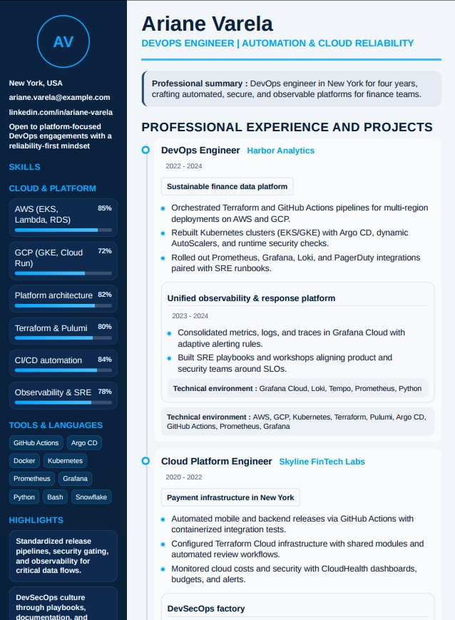
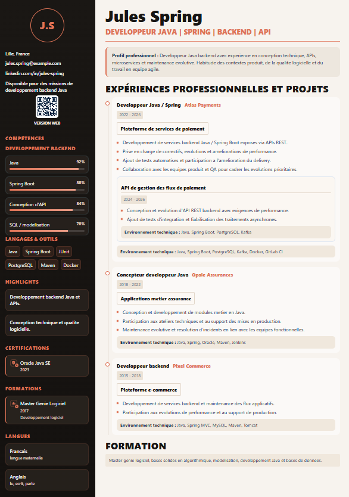
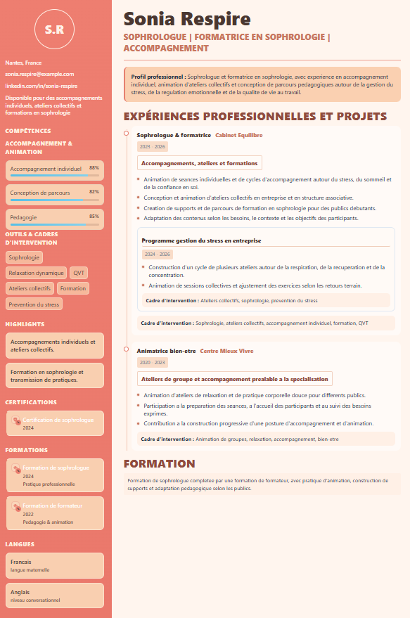

# CV Generator

CV Generator includes:

- a local **web UI** for human editing
- a reusable **Node engine** for rendering and validation
- a local **MCP server** for LLM / agent usage
- a local **CLI** for scripts and non-chat integrations

The public core of the project is `engine + MCP`.
The UI and CLI remain part of the repository for local use, but the main public agent-facing surface is `MCP`.

<table align="center">
  <tr>
    <td align="center">
      <a href="./cv.jpg">
        
      </a>
    </td>
    <td width="20"></td>
    <td align="center">
      <a href="./cv2.png">
        
      </a>
    </td>
    <td width="20"></td>
    <td align="center">
      <a href="./cv3.png">
        
      </a>
    </td>
  </tr>
</table>

## What the project does

- generates an HTML CV from a `CvData` JSON payload
- generates a headless PDF CV
- validates CV structure and pagination
- exposes these capabilities through a local MCP server and a local CLI

Public MCP tools:

- `generate_cv_html`
- `generate_cv_pdf`
- `validate_cv`
- `get_cv_schema`

Additional MCP tools for large payload workflows:

- `start_cv_chunked_generation`
- `append_cv_generation_chunk`

## Three usage modes

### 1. Local human usage

The web editor supports:

- editing content
- choosing the CV language (`english | french | spanish`)
- choosing the theme
- choosing the template style (`classic | compact | ultra-compact`)
- toggling exact skill percentages (`showSkillLevels`)
- configuring the sidebar
- importing / exporting JSON
- previewing the rendered output

Template style behavior:

- `classic`: current default layout with standard skill bars
- `compact`: denser layout, reduced spacing, and radar rendering for bar-based skill groups when relevant
- `ultra-compact`: one-column dense layout for long CVs, with skills near the top

### 2. LLM / agent usage

The local MCP server supports:

- validating a `CvData` payload
- generating HTML
- generating PDF in `paginated | continuous` mode
- retrieving the JSON schema
- reading `CvData` from a local JSON file through `cv_data_path`
- generating through a chunked workflow when `cv_data` exceeds 5000 characters

Important:

- the MCP tool never calls the UI
- it calls the Node engine
- the MCP server runs over `stdio`, not HTTP
- `cv_data_path` is resolved from the MCP server process, so use Windows paths when the MCP server runs on Windows
- for a local profile photo, prefer `header.photoPath` over raw `header.photoUrl`; configure `CV_GENERATOR_ALLOWED_ASSET_DIR` if the image is outside the MCP server current working directory
- generated PDF files are written to `CV_GENERATOR_OUTPUT_DIR` when configured, otherwise to the system temp directory
- for fake or realistic CV generation, starting from an existing example in `examples/` is more reliable than rebuilding JSON manually in an intermediate script

### 3. Script / terminal usage

The local CLI is aligned with the MCP surface and supports:

- retrieving the `CvData` schema
- validating a JSON `cv_data` file
- generating HTML
- generating PDF in `paginated | continuous` mode

## Prerequisites

- Node.js
- npm dependencies installed
- no system browser path is required in the normal MCP flow

## Installation

```bash
npm install
```

## Integrations

Supported in this version:

- local Hermes
- local Claude Code

Out of scope in this version:

- Claude.ai
- HTTP-hosted MCP

### npm package

Published package:

- `@xclem/cv-generator-mcp`

Run it directly from npm:

```bash
npx -y @xclem/cv-generator-mcp
```

### Publish the MCP package manually

For maintainers:

```bash
npm login
npm publish --access public
```

### Install the skill locally

For Hermes:

```bash
sh scripts/install-skill.sh hermes
```

For Claude Code:

```bash
sh scripts/install-skill.sh claude-code
```

### Hermes MCP config

```yaml
mcp_servers:
  cv_generator:
    command: "npx"
    args:
      - "-y"
      - "@xclem/cv-generator-mcp"
    env:
      CV_GENERATOR_ALLOWED_INPUT_DIR: "C:\\Users\\xclem\\cv-inputs"
      CV_GENERATOR_ALLOWED_ASSET_DIR: "C:\\Users\\xclem\\cv-assets"
      CV_GENERATOR_OUTPUT_DIR: "C:\\Users\\xclem\\cv-output"
    timeout: 180
    connect_timeout: 60
```

### Claude Code MCP config on Windows PowerShell

```powershell
claude mcp add cv-generator `
  -e CV_GENERATOR_ALLOWED_INPUT_DIR="C:\Users\xclem\cv-inputs" `
  -e CV_GENERATOR_ALLOWED_ASSET_DIR="C:\Users\xclem\cv-assets" `
  -e CV_GENERATOR_OUTPUT_DIR="C:\Users\xclem\cv-output" `
  -- npx.cmd -y @xclem/cv-generator-mcp@0.1.4
```

### Claude Code MCP config on macOS / Linux

```bash
claude mcp add cv-generator \
  -e CV_GENERATOR_ALLOWED_INPUT_DIR="$HOME/cv-inputs" \
  -e CV_GENERATOR_ALLOWED_ASSET_DIR="$HOME/cv-assets" \
  -e CV_GENERATOR_OUTPUT_DIR="$HOME/cv-output" \
  -- npx -y @xclem/cv-generator-mcp@0.1.4
```

### Repo-shipped skill

The portable skill bundle lives in:

- `skills/cv-generator/SKILL.md`
- `skills/cv-generator/references/cv-contract.md`
- `skills/cv-generator/agents/openai.yaml`

## Main commands

### Local UI

```bash
npm run dev
```

### Build

Current status:

- `npm run build` is green again
- local MCP packaging, tests, and the `npx` launcher are valid

```bash
npm run build
```

### Tests

```bash
npm test
```

### PDF smoke test

```bash
npm run smoke:pdf
```

Continuous PDF mode:

```bash
CV_PDF_MODE=continuous npm run smoke:pdf
```

Force a specific system browser path if needed:

```bash
CV_BROWSER_EXECUTABLE_PATH="/usr/bin/google-chrome" npm run smoke:pdf
```

On Windows PowerShell, use `$env:CV_PDF_MODE="continuous"` and `$env:CV_BROWSER_EXECUTABLE_PATH="C:\..."`.

### MCP server

```bash
npm run mcp
```

Packaged local version through `npx`:

```bash
npx -y @xclem/cv-generator-mcp
```

### Local CLI

```bash
npm run cli -- --help
```

Schema:

```bash
npm run cli -- get-cv-schema
```

Validation:

```bash
npm run cli -- validate-cv --cv-data ./examples/cv-minimal.json
```

HTML generation:

```bash
npm run cli -- generate-cv-html --cv-data ./examples/cv-minimal.json --output ./cv-output.html
```

PDF generation:

```bash
npm run cli -- generate-cv-pdf --cv-data ./examples/cv-minimal.json --pdf-mode paginated --output ./cv-output.pdf
```

MCP-aligned options:

- `--pdf-mode` / `--pdf_mode` (`paginated | continuous`)
- `--browser-executable-path` / `--browser_executable_path`
- `--cv-data` / `--cv_data` / `--input`

## JSON examples

Public examples are provided in `examples/`:

- `examples/cv-cloud-architect.json`
- `examples/cv-minimal.json`
- `examples/cv-devops.json`
- `examples/cv-java.json`
- `examples/cv-sophro.json`

The `examples/` folder may also contain additional working or targeted CV variants used to iterate on real scenarios.

## Input contract

The main input contract remains `CvData`.

The main rules to remember are:

- business and render settings live inside `cv_data`
- `theme`, `sidebarPosition`, `maxPages`, `language`, `templateStyle`, and `showSkillLevels` live inside `cv_data.render`
- schema keys remain in English regardless of the visible CV language
- `pdf_mode` and `browser_executable_path` (optional) are MCP execution parameters, not business fields of the CV
- MCP tools accept either inline `cv_data` or `cv_data_path`, but not both in the same call

Example:

```json
{
  "cv_data": {
    "render": {
      "theme": "ocean",
      "sidebarPosition": "left",
      "maxPages": 2,
      "language": "english",
      "templateStyle": "classic",
      "showSkillLevels": true
    }
  },
  "pdf_mode": "paginated"
}
```

## Logical usage examples

### Validation

The MCP client sends:

```json
{
  "cv_data": {
    "header": {
      "name": "Alex Martin",
      "badgeText": "A.M",
      "photoUrl": "",
      "showPhoto": false,
      "photoZoom": 100,
      "headline": "DEVOPS | CLOUD | AUTOMATION",
      "location": "Paris, France",
      "email": "alex.martin@example.com",
      "phone": "+33 6 12 34 56 78",
      "linkedin": "linkedin.com/in/alex-martin",
      "github": "github.com/alex-martin",
      "availabilityText": "Available for DevOps and Cloud engagements",
      "qrCodeLabel": "Web version",
      "qrCodeUrl": "https://example.com/cv/alex-martin",
      "showQrCode": true
    },
    "profileLabel": "Professional profile",
    "profile": "DevOps engineer with experience in automation, CI/CD, and public cloud.",
    "skillGroups": [],
    "highlights": [],
    "certifications": [],
    "formations": [],
    "languages": [],
    "experiences": [],
    "mainEducation": {
      "enabled": true,
      "title": "Education",
      "summary": "Master's degree in Computer Science."
    },
    "render": {
      "mode": "preview",
      "maxPages": 2,
      "theme": "ocean",
      "sidebarPosition": "left",
      "language": "english",
      "templateStyle": "classic",
      "showSkillLevels": true
    }
  }
}
```

### HTML generation

Tool call:

```json
{
  "name": "generate_cv_html",
  "arguments": {
    "cv_data": {}
  }
}
```

### PDF generation

Tool call:

```json
{
  "name": "generate_cv_pdf",
  "arguments": {
    "cv_data": {},
    "pdf_mode": "paginated",
    "browser_executable_path": "C:\\Program Files\\Google\\Chrome\\Application\\chrome.exe"
  }
}
```

Or:

```json
{
  "name": "generate_cv_pdf",
  "arguments": {
    "cv_data": {},
    "pdf_mode": "continuous"
  }
}
```

## MCP tools

### `get_cv_schema`

Returns the JSON Schema for the `CvData` contract.

MCP client compatibility:

- the complete schema is returned in `structuredContent.schema`
- a text copy is also duplicated in `content[].text` for clients that do not expose `structuredContent` to the model

### `validate_cv`

Validates a `CvData`, normalizes the input, and returns:

- `page_count`
- `page_limit_exceeded`
- `issues`
- `structure_messages`
- `normalized_cv_data`

Input:

- `cv_data` for small inline payloads
- `cv_data_path` for a local `.json` file readable by the MCP server process

### `generate_cv_html`

Generates the final CV HTML without editor chrome.

Direct-call limit:

- `cv_data` stringified length must be `<= 5000`
- otherwise, prefer `cv_data_path`; use the chunked workflow as fallback

### `generate_cv_pdf`

Generates a PDF through `Vivliostyle` from the HTML/CSS template:

- `pdf_mode: "paginated"` for a classic CV
- `pdf_mode: "continuous"` for a single-flow export better suited to screen reading

Direct-call limit:

- `cv_data` stringified length must be `<= 5000`
- otherwise, prefer `cv_data_path`; use the chunked workflow as fallback

### Local file input with `cv_data_path`

For large CVs, write the JSON to a local file and pass only its path to the MCP tool:

```json
{
  "cv_data_path": "C:\\Users\\xclem\\cv-inputs\\cv.json",
  "pdf_mode": "continuous"
}
```

The path must be valid from the MCP server process. If the MCP server runs on Windows, use a Windows path. If an agent runs in WSL but the MCP server runs on Windows, convert paths before calling the tool, for example with `wslpath -w`.

By default, the server accepts files under its current working directory. To allow a dedicated input folder, set:

```json
{
  "env": {
    "CV_GENERATOR_ALLOWED_INPUT_DIR": "C:\\Users\\xclem\\cv-inputs"
  }
}
```

Safety rules:

- `cv_data_path` must resolve inside `CV_GENERATOR_ALLOWED_INPUT_DIR`, or inside the MCP server `cwd` when the env var is absent
- the file must have a `.json` extension
- the file size must be `<= 1000000` bytes

### Local photo input with `photoPath`

For local MCP / CLI usage, prefer `header.photoPath` for a profile photo instead of embedding raw base64 in `header.photoUrl`:

```json
{
  "header": {
    "showPhoto": true,
    "photoPath": "C:\\Users\\xclem\\cv-assets\\photo.jpg",
    "photoUrl": ""
  }
}
```

At runtime, the Node engine reads the file, converts it to a data URL, and uses that value for rendering. `photoUrl` remains supported for remote URLs or already encoded data URLs, but `photoPath` takes precedence when present.

The path must be valid from the MCP server process. If the MCP server runs on Windows, use a Windows path.

By default, photo files must resolve inside the server current working directory. To authorize a dedicated asset directory, configure:

```json
{
  "env": {
    "CV_GENERATOR_ALLOWED_ASSET_DIR": "C:\\Users\\xclem\\cv-assets"
  }
}
```

Safety rules:

- `photoPath` must resolve inside `CV_GENERATOR_ALLOWED_ASSET_DIR`, or inside the MCP server `cwd` when the env var is absent
- accepted extensions: `.jpg`, `.jpeg`, `.png`, `.webp`, `.gif`
- max file size: `5000000` bytes

### Output directory with `CV_GENERATOR_OUTPUT_DIR`

MCP `generate_cv_pdf` writes the generated PDF to disk and returns `file_path`.

By default, files are written under the system temp directory. To make outputs easier to find, configure:

```json
{
  "env": {
    "CV_GENERATOR_OUTPUT_DIR": "C:\\Users\\xclem\\cv-output"
  }
}
```

The directory is created automatically if it does not exist.

For CLI usage, `--output <file>` still takes precedence. If `--output` is absent, `CV_GENERATOR_OUTPUT_DIR` is used when configured.

### `start_cv_chunked_generation`

Opens a chunked upload session and returns an `upload_id`.

Important:

- reuse that exact `upload_id` in `append_cv_generation_chunk`
- if the client sends a wrong `upload_id` and only one session is active, the server attempts an automatic recovery

Parameters:

- `upload_id` (optional, explicit client identifier)
- `output_format: "pdf" | "html"` (default `pdf`)
- `pdf_mode: "paginated" | "continuous"` (used only for `pdf`)
- `browser_executable_path` (optional)

### `append_cv_generation_chunk`

Appends a JSON fragment to a chunked session.

Parameters:

- `upload_id`
- `chunk_index` (0-based)
- `total_chunks`
- `chunk` (`<= 5000` characters)

Behavior:

- until all chunks are received: response `upload_completed: false`
- on the last chunk: JSON reassembly + validation + automatic generation (`html` or `pdf`)

Useful notes:

- the main PDF backend is `@vivliostyle/cli`
- rendering is therefore much closer to the source HTML/CSS than the old manually reconstructed PDF approach
- the MCP tool does not require a system browser path in the nominal case
- `browser_executable_path` remains available as an optional override if the local headless environment is incomplete
- the first PDF render can be slower while the headless runtime becomes ready
- this backend choice also means its license and distribution impact should be tracked

## Size limit for MCP generation

For `generate_cv_html` and `generate_cv_pdf`:

- the server rejects direct calls if `JSON.stringify(cv_data).length > 5000`
- error code: `cv_data_too_large_for_single_call`

Recommended workflow for large CVs:

1. write the JSON to a local `.json` file in the allowed input directory
2. call `validate_cv`, `generate_cv_html`, or `generate_cv_pdf` with `cv_data_path`
3. use `start_cv_chunked_generation` + `append_cv_generation_chunk` only when file input is not available

## Behavior when the page limit is exceeded

If `cv_data.render.maxPages` is defined and the rendered result exceeds it:

- `validate_cv` returns `page_limit_exceeded: true`
- `generate_cv_html` returns a structured error
- `generate_cv_pdf` returns a structured error in `paginated` mode
- `generate_cv_pdf` remains allowed in `continuous` mode

## Target compatibility

The project is designed first for:

- Claude Agent SDK
- OpenClaw / NanoClaw
- LM Studio through an appropriate MCP wrapper / bridge

The key idea is:

- the engine is independent
- MCP is the main exposure layer

## Documentation

Main documents:

- [Application architecture](./APPLICATION_ARCHITECTURE_CV_GENERATOR.md)

## Beta V1 status

Beta V1 means a repository that is publishable and usable with:

- a working Node engine
- a local MCP server
- a published npm package
- the local UI preserved
- public JSON examples
- reproducible tests

It is not yet:

- an official Docker container
- a product with guaranteed compatibility across all environments

## License

MIT

Notes:

- the project itself is under the `MIT` license
- some dependencies may have their own license; in particular, the current PDF backend `@vivliostyle/cli` should be reviewed before broader community distribution
